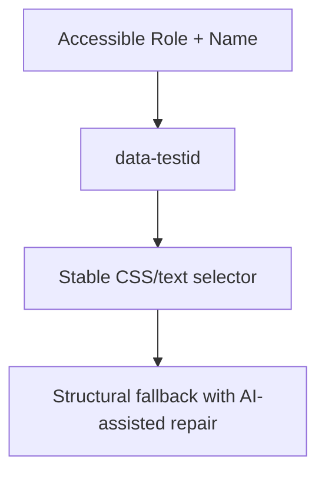

# Locator Engine

## Executive Summary
Generates and maintains resilient element locators using a priority order — role/accessible-name locators first, then stable test IDs, then structural fallback — and automatically repairs broken locators when DOM Intelligence detects a structural change that preserves semantic intent.

## Locator Priority

## Anti-Pattern
Hardcoded, brittle CSS selectors tied to layout/styling classes — the leading cause of test maintenance debt in traditional automation.

## References
- [../08-browser-intelligence/dom-intelligence.md](../08-browser-intelligence/dom-intelligence.md)
