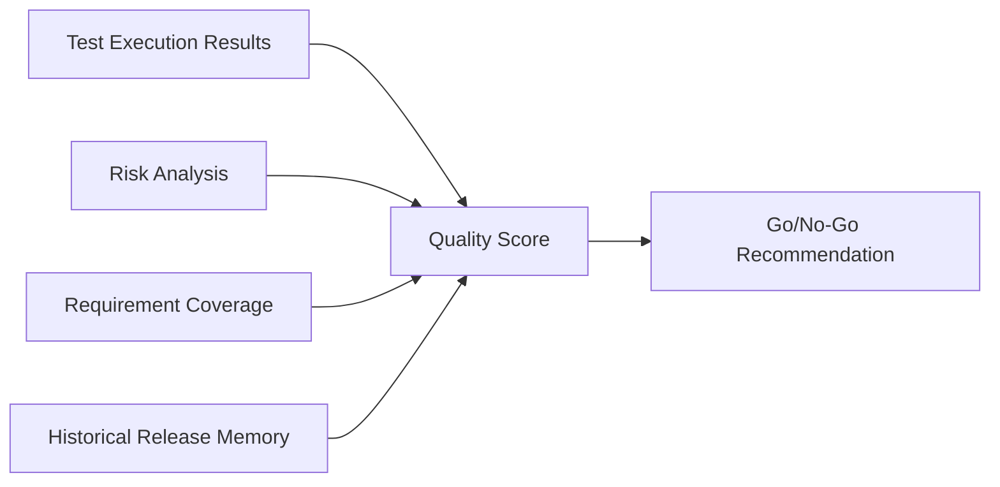

# Release Readiness

## Executive Summary
Release Readiness is PAIOS's flagship output: a synthesized judgment of whether a given release candidate is safe to ship, combining test results, risk analysis, and historical release outcomes.

## Model Inputs

## References
- [quality-score.md](quality-score.md)
- [go-no-go.md](go-no-go.md)
