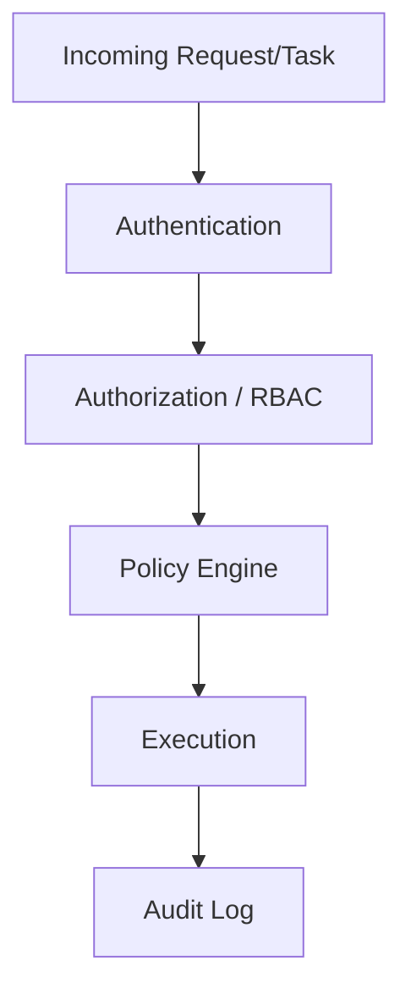

# Security Model

## Executive Summary
Security is enforced at every architectural layer: kernel-level task authentication, agent-level RBAC, and policy-engine-level governance of autonomous actions, with an immutable audit trail spanning all three.

## Diagram

## References
- [rbac.md](rbac.md)
- [policy-engine.md](policy-engine.md)
