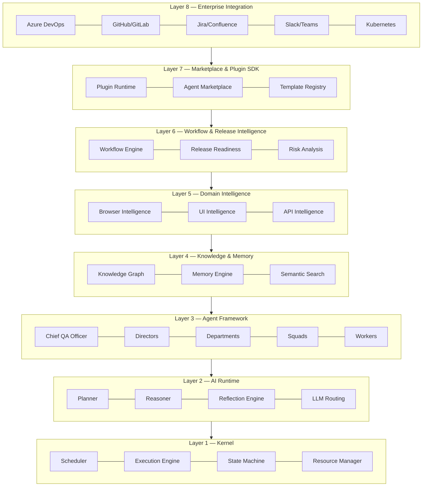
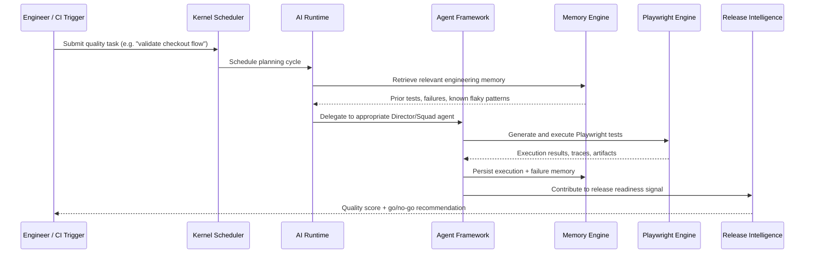

# ARCHITECTURE

This document provides the condensed, top-level architectural summary of PAIOS. For full detail, see [`docs/01-architecture/README.md`](docs/01-architecture/README.md) and the subsystem-specific documents linked throughout.

## Layered System Model

PAIOS is organized into eight architectural layers, each with a clear responsibility boundary and a well-defined interface to the layers above and below it.

| Layer | Responsibility | Documentation |
|---|---|---|
| 1. Kernel | Process scheduling, execution, resource arbitration | [docs/02-kernel](docs/02-kernel/README.md) |
| 2. AI Runtime | Planning, reasoning, reflection, model routing | [docs/03-ai-runtime](docs/03-ai-runtime/README.md) |
| 3. Agent Framework | Organizational hierarchy and coordination | [docs/04-agent-framework](docs/04-agent-framework/README.md) |
| 4. Knowledge & Memory | Durable engineering knowledge | [docs/05-memory-engine](docs/05-memory-engine/README.md), [docs/06-knowledge-graph](docs/06-knowledge-graph/README.md) |
| 5. Domain Intelligence | Browser, UI, and API understanding | [docs/08-browser-intelligence](docs/08-browser-intelligence/README.md) |
| 6. Workflow & Release | Orchestration and release confidence | [docs/13-workflow-engine](docs/13-workflow-engine/README.md), [docs/12-release-intelligence](docs/12-release-intelligence/README.md) |
| 7. Marketplace & SDK | Extensibility | [docs/16-plugin-sdk](docs/16-plugin-sdk/README.md) |
| 8. Enterprise Integration | External system connectors | [docs/15-enterprise](docs/15-enterprise/README.md) |

## Request Lifecycle (Sequence Overview)

## Cross-Cutting Concerns

- **Security** is enforced at every layer boundary via the policy engine — see [docs/17-security](docs/17-security/README.md).
- **Observability** instruments every kernel task, agent action, and workflow step — see [docs/14-observability](docs/14-observability/README.md).
- **Extensibility** is available at Layers 5–8 via the Plugin SDK — see [docs/16-plugin-sdk](docs/16-plugin-sdk/README.md).

## References

- [docs/01-architecture/system-overview.md](docs/01-architecture/system-overview.md)
- [docs/01-architecture/layered-architecture.md](docs/01-architecture/layered-architecture.md)
- [VISION.md](VISION.md)
