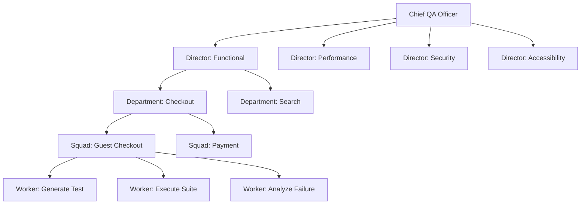

# Diagram: Agent Hierarchy

```mermaid
graph TD
    CQO[Chief QA Officer] --> D1[Director: Functional]
    CQO --> D2[Director: Performance]
    CQO --> D3[Director: Security]
    CQO --> D4[Director: Accessibility]
    D1 --> DEP1[Department: Checkout]
    D1 --> DEP2[Department: Search]
    DEP1 --> SQ1[Squad: Guest Checkout]
    DEP1 --> SQ2[Squad: Payment]
    SQ1 --> W1[Worker: Generate Test]
    SQ1 --> W2[Worker: Execute Suite]
    SQ1 --> W3[Worker: Analyze Failure]
```

Referenced from [docs/04-agent-framework/README.md](../docs/04-agent-framework/README.md).
