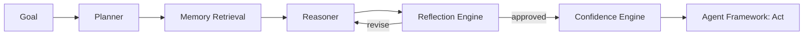

# Diagram: AI Runtime

```mermaid
graph LR
    G[Goal] --> PL[Planner]
    PL --> MR[Memory Retrieval]
    MR --> RS[Reasoner]
    RS --> RE[Reflection Engine]
    RE -->|revise| RS
    RE -->|approved| CE[Confidence Engine]
    CE --> AF[Agent Framework: Act]
```

Referenced from [docs/03-ai-runtime/runtime-overview.md](../docs/03-ai-runtime/runtime-overview.md).
