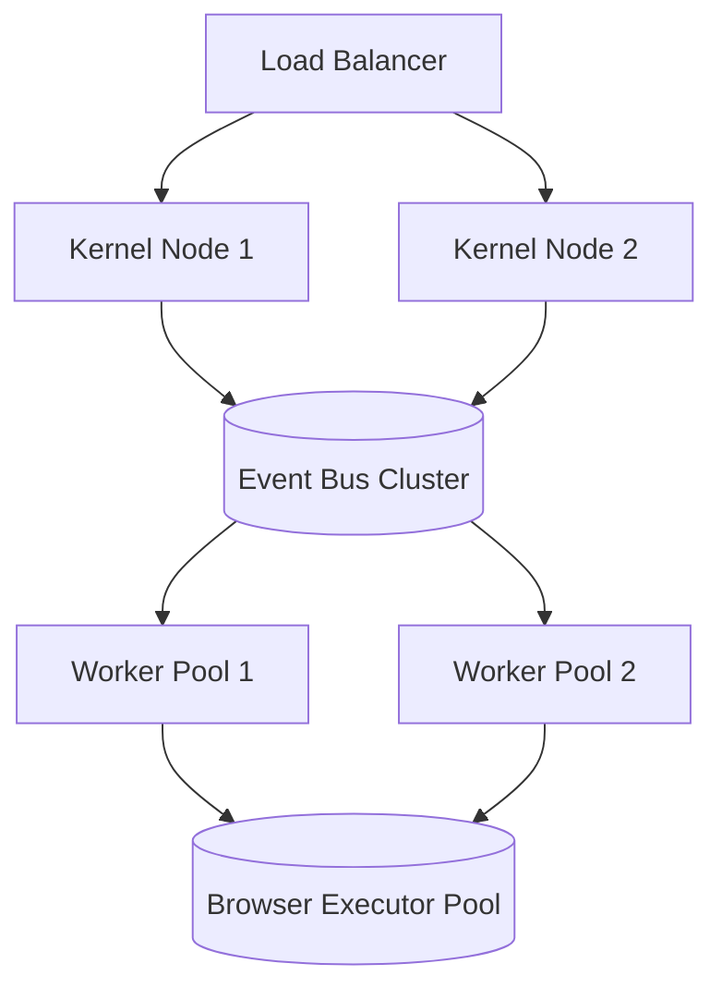

# Diagram: Deployment

```mermaid
graph TB
    LB[Load Balancer] --> K1[Kernel Node 1]
    LB --> K2[Kernel Node 2]
    K1 --> EB[(Event Bus Cluster)]
    K2 --> EB
    EB --> W1[Worker Pool 1]
    EB --> W2[Worker Pool 2]
    W1 --> BR[(Browser Executor Pool)]
    W2 --> BR
```

Referenced from [docs/01-architecture/deployment-topology.md](../docs/01-architecture/deployment-topology.md).
