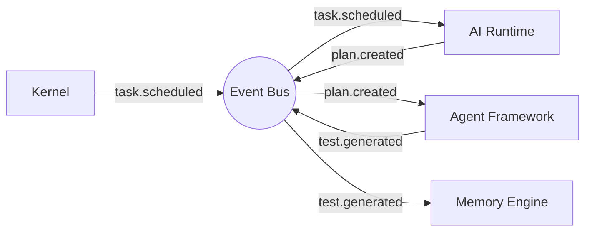

# Diagram: Event Bus

```mermaid
graph LR
    K[Kernel] -- task.scheduled --> EB((Event Bus))
    EB -- task.scheduled --> AR[AI Runtime]
    AR -- plan.created --> EB
    EB -- plan.created --> AF[Agent Framework]
    AF -- test.generated --> EB
    EB -- test.generated --> ME[Memory Engine]
```

Referenced from [docs/01-architecture/event-driven.md](../docs/01-architecture/event-driven.md).
