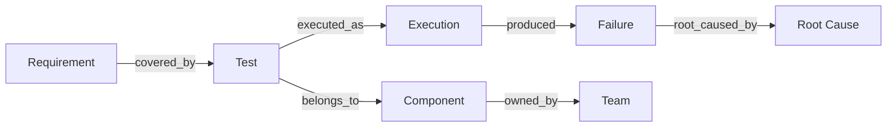

# Diagram: Knowledge Graph

```mermaid
graph LR
    REQ[Requirement] -->|covered_by| TEST[Test]
    TEST -->|executed_as| EXEC[Execution]
    EXEC -->|produced| FAIL[Failure]
    FAIL -->|root_caused_by| RC[Root Cause]
    TEST -->|belongs_to| COMP[Component]
    COMP -->|owned_by| TEAM[Team]
```

Referenced from [docs/06-knowledge-graph/graph-model.md](../docs/06-knowledge-graph/graph-model.md).
