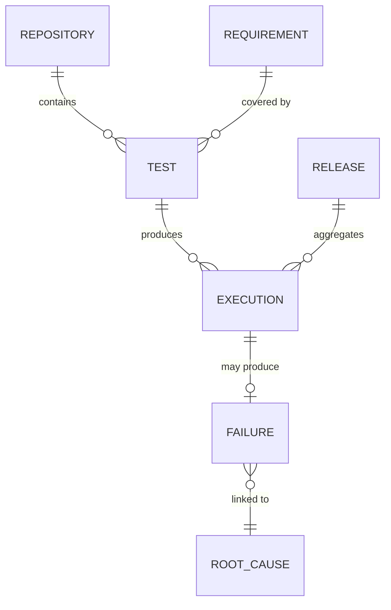

# Diagram: Memory Engine

```mermaid
erDiagram
    REPOSITORY ||--o{ TEST : contains
    REQUIREMENT ||--o{ TEST : "covered by"
    TEST ||--o{ EXECUTION : produces
    EXECUTION ||--o| FAILURE : "may produce"
    FAILURE }o--|| ROOT_CAUSE : "linked to"
    RELEASE ||--o{ EXECUTION : aggregates
```

Referenced from [docs/05-memory-engine/engineering-memory.md](../docs/05-memory-engine/engineering-memory.md).
