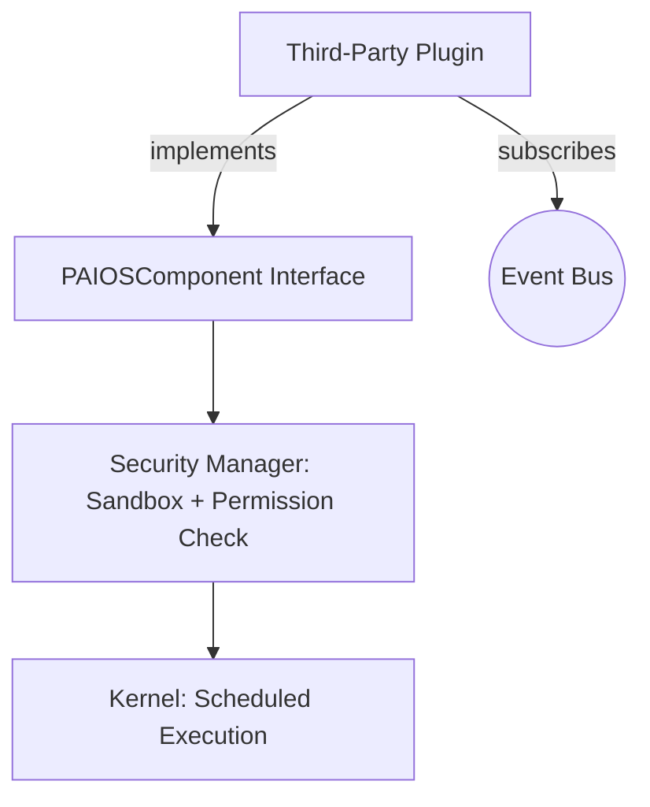

# Diagram: Plugin SDK

```mermaid
graph TD
    PLG[Third-Party Plugin] -->|implements| COMP[PAIOSComponent Interface]
    COMP --> SEC[Security Manager: Sandbox + Permission Check]
    SEC --> KRN[Kernel: Scheduled Execution]
    PLG -->|subscribes| EB((Event Bus))
```

Referenced from [docs/16-plugin-sdk/plugin-architecture.md](../docs/16-plugin-sdk/plugin-architecture.md).
