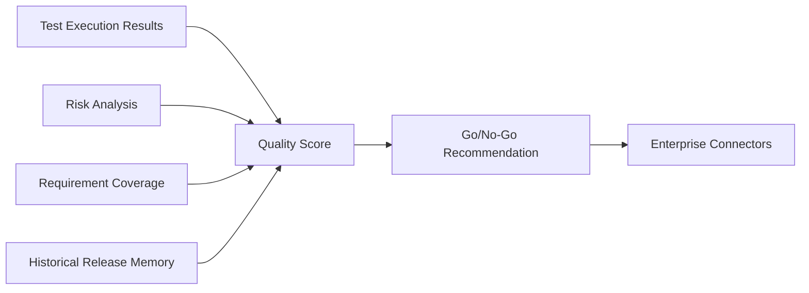

# Diagram: Release Pipeline

```mermaid
graph LR
    A[Test Execution Results] --> Q[Quality Score]
    B[Risk Analysis] --> Q
    C[Requirement Coverage] --> Q
    D[Historical Release Memory] --> Q
    Q --> GN[Go/No-Go Recommendation]
    GN --> ENT[Enterprise Connectors]
```

Referenced from [docs/12-release-intelligence/release-readiness.md](../docs/12-release-intelligence/release-readiness.md).
