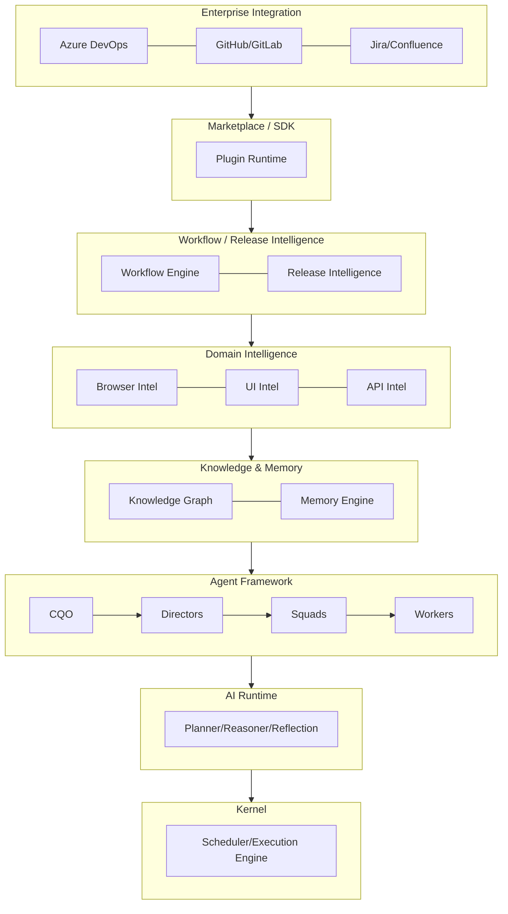

# Diagram: System Architecture

```mermaid
graph TB
    subgraph L8["Enterprise Integration"]
        A1[Azure DevOps]:::ent --- A2[GitHub/GitLab]:::ent --- A3[Jira/Confluence]:::ent
    end
    subgraph L7["Marketplace / SDK"]
        B1[Plugin Runtime]:::sdk
    end
    subgraph L6["Workflow / Release Intelligence"]
        C1[Workflow Engine]:::wf --- C2[Release Intelligence]:::wf
    end
    subgraph L5["Domain Intelligence"]
        D1[Browser Intel]:::dom --- D2[UI Intel]:::dom --- D3[API Intel]:::dom
    end
    subgraph L4["Knowledge & Memory"]
        E1[Knowledge Graph]:::mem --- E2[Memory Engine]:::mem
    end
    subgraph L3["Agent Framework"]
        F1[CQO]:::agent --> F2[Directors]:::agent --> F3[Squads]:::agent --> F4[Workers]:::agent
    end
    subgraph L2["AI Runtime"]
        G1[Planner/Reasoner/Reflection]:::ai
    end
    subgraph L1["Kernel"]
        H1[Scheduler/Execution Engine]:::kernel
    end
    L8-->L7-->L6-->L5-->L4-->L3-->L2-->L1
```

Referenced from [ARCHITECTURE.md](../ARCHITECTURE.md).
