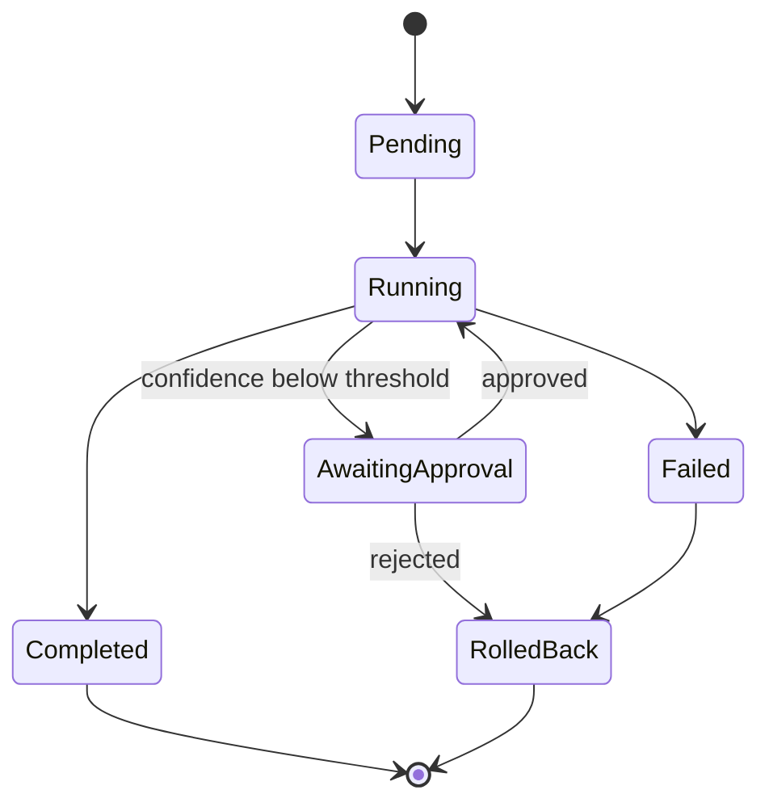

# Diagram: Workflow Engine

```mermaid
stateDiagram-v2
    [*] --> Pending
    Pending --> Running
    Running --> AwaitingApproval: confidence below threshold
    AwaitingApproval --> Running: approved
    AwaitingApproval --> RolledBack: rejected
    Running --> Completed
    Running --> Failed
    Failed --> RolledBack
    Completed --> [*]
    RolledBack --> [*]
```

Referenced from [docs/13-workflow-engine/workflow-state-machine.md](../docs/13-workflow-engine/workflow-state-machine.md).
