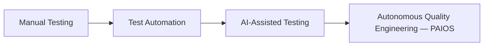

# Vision (Introduction-Level)

This document restates and expands the root [VISION.md](../../VISION.md) in the context of the introduction section, for readers proceeding sequentially through the documentation.

## Executive Summary

PAIOS envisions a future where quality engineering organizations operate with an always-on, ever-learning AI operating system as a peer participant — not a tool invoked on demand, but a persistent system that observes, remembers, plans, and acts within explicit governance boundaries.

## The Shift We're Building Toward

Each transition preserved what worked and removed a category of human toil: automation removed repetitive execution; AI assistance removed blank-page authoring friction; autonomous quality engineering removes the need for humans to be the connective tissue between test results, historical knowledge, and release decisions.

## Guiding Vision Statements

- Quality knowledge should never be lost when an engineer leaves a team.
- A release decision should be as explainable as a compiler error.
- Test maintenance should be a background system process, not a sprint task.

## References

- [../../VISION.md](../../VISION.md)
- [mission.md](mission.md)
