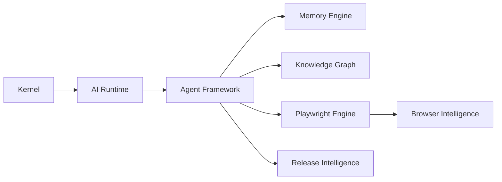

# What Is PAIOS

## Executive Summary

PAIOS (Playwright AI Operating System) is a layered, agentic runtime that provides quality engineering as an operating-system-level service rather than as a library or framework. It combines a task-scheduling kernel, an AI planning and reasoning runtime, a hierarchical multi-agent organization, a durable engineering memory and knowledge graph, and deep browser/API/UI intelligence, all orchestrated to autonomously generate, execute, diagnose, and reason about software quality on behalf of an engineering organization.

## Purpose

This document gives a precise, unambiguous technical definition of PAIOS to anchor every other document in this repository.

## Background

Test automation frameworks such as Selenium, Cypress, and Playwright solved the problem of **programmatic browser control**: they let engineers drive a browser via code instead of a human clicking through a UI. This was a necessary but incomplete solution. It automated the *execution* of a test that a human had already designed, but left every other part of the quality engineering lifecycle — deciding what to test, writing the test, maintaining it as the UI changes, diagnosing why it failed, and deciding whether a release is safe — entirely in human hands.

PAIOS was designed to close that gap by treating the entire lifecycle as a single, coherent, stateful system rather than a collection of disconnected scripts and dashboards.

## Why This Component Exists

Without PAIOS, an organization's quality engineering knowledge — the "why does this test exist," "why did this fail three sprints ago," "which parts of the checkout flow are historically fragile" — lives in the heads of individual engineers, scattered Confluence pages, and Slack threads. It is lost when engineers leave and rediscovered painfully when incidents recur. PAIOS exists to make this knowledge a durable, queryable, ever-growing system asset.

## Design Goals

1. Treat quality engineering knowledge as a durable, first-class system resource.
2. Provide layered autonomy — from assisted test authoring to fully autonomous release decisions — with explicit governance at every layer.
3. Be observable and explainable: every autonomous action must be traceable to supporting evidence.
4. Be extensible: support enterprise tools and third-party plugins without core modification.

## Design Principles

- **Memory before intelligence.** No agent decision is made without first consulting engineering memory.
- **Explainability over black-box confidence.** Every quality score or go/no-go decision must cite its evidence.
- **Composable autonomy.** Every layer of the system can operate in human-supervised or autonomous mode independently.
- **Kernel-first design.** All higher-layer capability is built on top of a small, well-defined kernel — not the other way around.

## Internal Architecture (High-Level)

See [docs/01-architecture](../01-architecture/README.md) for full detail.

## Examples

**Example 1 — Assisted mode.** An engineer writes a Gherkin scenario for a new checkout feature. PAIOS's Worker agents generate the corresponding Playwright test, propose locators via the [Locator Engine](../09-playwright-engine/locator-engine.md), and submit a PR for human review.

**Example 2 — Autonomous mode.** On every merge to `main`, PAIOS's Squad agents automatically detect which product areas were affected by the diff (via the [Knowledge Graph](../06-knowledge-graph/README.md)), select and execute the relevant regression suite, and report a quality score to the [Release Intelligence](../12-release-intelligence/README.md) subsystem without human intervention, escalating only if confidence falls below a configured threshold.

## Enterprise Scenarios

A multinational retail company with 40 microservices and 12 quality engineering teams uses PAIOS to maintain a single, organization-wide engineering memory. When a payment-service regression is discovered in Team A's release, PAIOS's memory engine surfaces the same failure signature in Team B's historical data from 8 months earlier, immediately linking the two incidents and surfacing the prior root cause.

## Best Practices

- Start in assisted mode and graduate to autonomous mode per product area as trust is established.
- Configure policy boundaries explicitly rather than relying on defaults (see [docs/17-security/policy-engine.md](../17-security/policy-engine.md)).
- Treat the knowledge graph as a first-class artifact to review, not a black box.

## Anti-Patterns

- Running PAIOS in fully autonomous mode on a codebase with no historical memory — the system needs time to build engineering memory before autonomous decisions are trustworthy.
- Bypassing the agent framework by scripting directly against the Playwright engine — this forfeits memory capture and knowledge graph updates.

## Configuration

See [docs/02-kernel/README.md](../02-kernel/README.md) and [docs/17-security/README.md](../17-security/README.md) for kernel and policy configuration.

## APIs

PAIOS exposes a task submission API at the kernel boundary; see [docs/02-kernel/execution-engine.md](../02-kernel/execution-engine.md).

## Security Considerations

All agent actions are mediated by the [Policy Engine](../17-security/policy-engine.md) and logged to the [Audit Log](../17-security/audit-logs.md).

## Scalability

The kernel and agent framework are designed for horizontal scaling across distributed workers; see [docs/01-architecture/distributed-architecture.md](../01-architecture/distributed-architecture.md).

## Failure Handling

See [docs/02-kernel/scheduler.md](../02-kernel/scheduler.md) for task retry and failure isolation semantics.

## Performance

See [benchmarks/](../../benchmarks/) for throughput and latency benchmarks.

## Future Improvements

See [future.md](future.md) and [docs/19-research/README.md](../19-research/README.md).

## References

- [why-paios.md](why-paios.md)
- [docs/01-architecture/system-overview.md](../01-architecture/system-overview.md)
