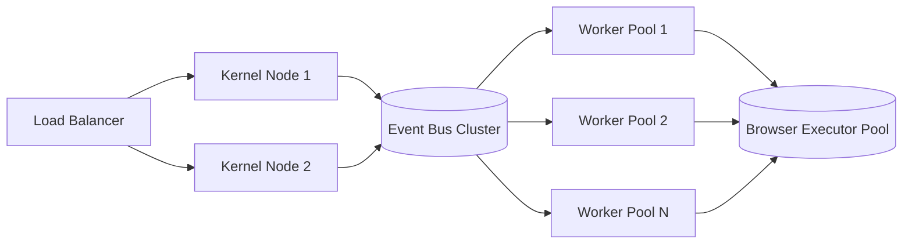

# Distributed Architecture

## Executive Summary
PAIOS scales horizontally across three independent axes: kernel task throughput, agent concurrency, and browser execution parallelism.

## Scaling Model

## Consistency Model
Kernel state is strongly consistent (single writer per task via optimistic locking); memory engine writes are eventually consistent across regions to support multi-region deployments.

## Failure Domains
Each worker pool is an independent failure domain; a crashed browser executor does not affect kernel or other pools (see [docs/02-kernel/scheduler.md](../02-kernel/scheduler.md) for retry semantics).

## References
- [physical-architecture.md](physical-architecture.md)
- [scalability.md](scalability.md)
