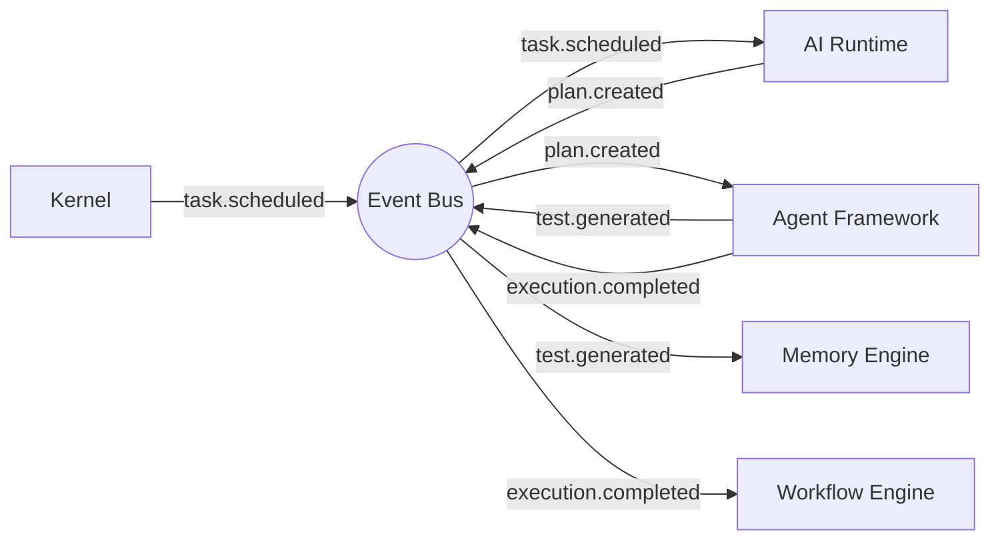

# Event-Driven Architecture

## Executive Summary
The PAIOS event bus is the backbone of cross-plane communication. All significant state transitions are published as immutable, versioned events.

## Core Event Types

| Event | Emitted By | Consumed By |
|---|---|---|
| `task.scheduled` | Kernel | AI Runtime |
| `plan.created` | AI Runtime | Agent Framework |
| `test.generated` | Worker Agent | Memory Engine, Knowledge Graph |
| `execution.completed` | Playwright Engine | Memory Engine, Workflow Engine |
| `failure.detected` | Playwright Engine | Memory Engine, Agent Framework |
| `release.scored` | Release Intelligence | Enterprise Connectors |

## Diagram

## References
- [communication.md](communication.md)
