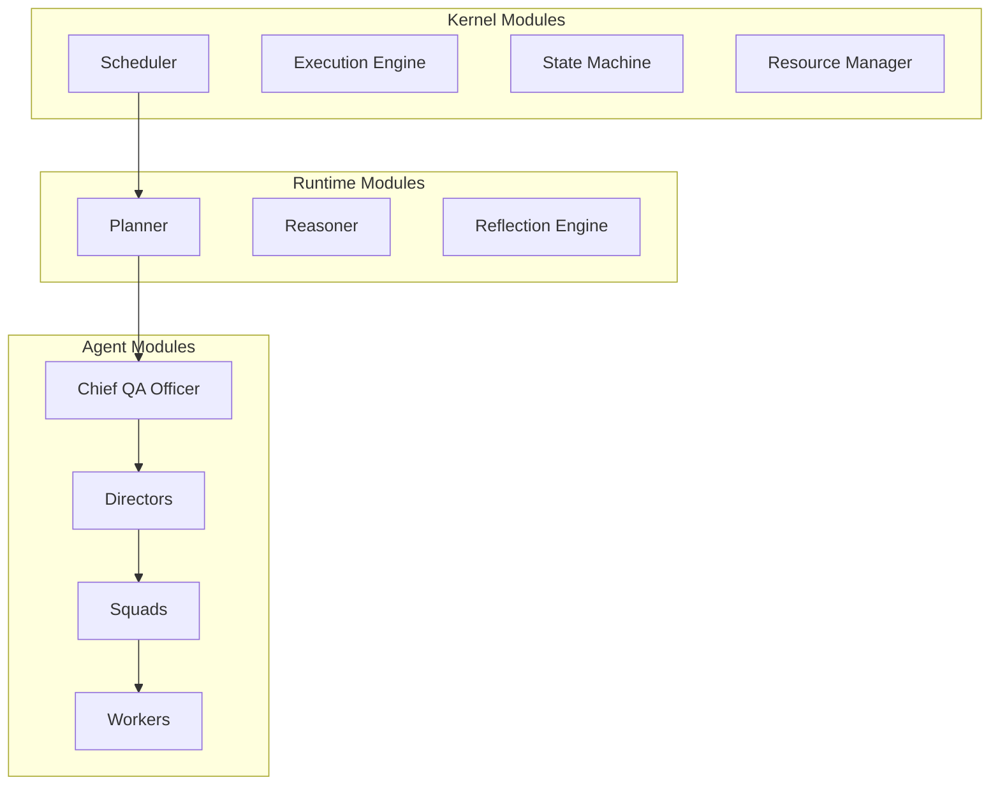

# Logical Architecture

## Executive Summary
Defines PAIOS's module boundaries independent of physical deployment: kernel modules, runtime modules, agent modules, and domain modules, each exposing a versioned internal API.

## Module Map

## Design Goals
Each module exposes exactly one public interface and one internal implementation, enabling module replacement (e.g., swapping the Reasoner's underlying LLM provider) without touching consumers.

## Best Practices
Define module interfaces in [specifications/](../../specifications/) before implementation.

## References
- [component-model.md](component-model.md)
