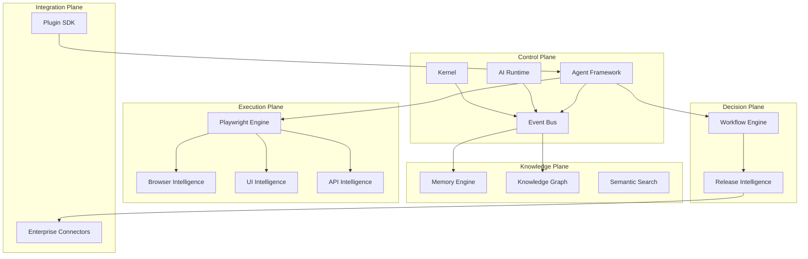

# System Overview

## Executive Summary
PAIOS is a distributed system composed of a kernel, an AI runtime, a multi-agent framework, memory and knowledge subsystems, domain intelligence engines, a workflow/release layer, and enterprise integrations, all communicating through a central event bus and a shared state store.

## Purpose
This document is the canonical entry point for understanding how PAIOS's components fit together end to end.

## Background
Section [00-introduction](../00-introduction/README.md) established *why* PAIOS exists. This document establishes *how* it is built.

## Design Goals
- Clear separation of concerns between scheduling (kernel), reasoning (AI runtime), and domain execution (Playwright engine, browser intelligence).
- A single source of truth for state (kernel state store) to avoid split-brain agent behavior.
- Loose coupling via an event bus so subsystems can be scaled, deployed, and replaced independently.

## Internal Architecture

## Components
See [component-model.md](component-model.md) for individual component contracts.

## Lifecycle
1. A task enters the kernel (from CI, a human, or a scheduled trigger).
2. The kernel schedules the task and hands it to the AI runtime for planning.
3. The AI runtime, informed by memory and knowledge graph queries, delegates to the agent framework.
4. Agents execute via the Playwright engine and domain intelligence engines.
5. Results flow back through memory persistence, workflow evaluation, and (if applicable) release intelligence.

## Data Flow
See [communication.md](communication.md) and [event-driven.md](event-driven.md).

## Sequence Diagram
See [ARCHITECTURE.md](../../ARCHITECTURE.md#request-lifecycle-sequence-overview) in the repository root for the canonical request lifecycle sequence.

## Examples
A nightly regression run: the kernel schedules the "nightly-regression" workflow (defined via the [Workflow DSL](../13-workflow-engine/workflow-dsl.md)), which fans out to Squad agents per product area, each executing their owned Playwright suites in parallel, with results aggregated into a single Release Intelligence quality score by morning.

## Enterprise Scenarios
See [docs/15-enterprise/README.md](../15-enterprise/README.md) for how this system overview maps onto real CI/CD pipelines (Azure DevOps, Jenkins, GitHub Actions).

## Best Practices
- Treat the event bus as the integration point for new subsystems, not direct component-to-component calls.
- Keep the kernel free of domain-specific logic.

## Anti-Patterns
- Bypassing the event bus for "fast path" direct calls between agent framework and Playwright engine — this breaks observability and memory capture.

## Configuration
See [docs/02-kernel/README.md](../02-kernel/README.md).

## APIs
See [docs/02-kernel/execution-engine.md](../02-kernel/execution-engine.md).

## Security Considerations
All cross-plane communication passes through the policy engine; see [docs/17-security/policy-engine.md](../17-security/policy-engine.md).

## Scalability
See [scalability.md](scalability.md) and [distributed-architecture.md](distributed-architecture.md).

## Failure Handling
Each plane is independently restartable; the event bus persists undelivered events for replay (see [availability.md](availability.md)).

## Performance
See [benchmarks/](../../benchmarks/).

## Future Improvements
Federation of the Knowledge Plane across multiple PAIOS deployments (multi-cluster memory federation) — tracked in [ROADMAP.md](../../ROADMAP.md) Horizon 2.

## References
- [layered-architecture.md](layered-architecture.md)
- [component-model.md](component-model.md)
