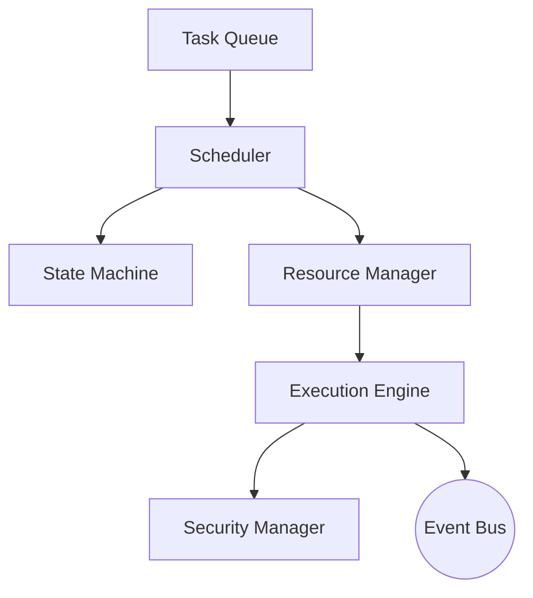

# Kernel Overview

## Executive Summary
The kernel is PAIOS's smallest, most stable layer. It schedules tasks, tracks their state, arbitrates resources, and enforces baseline security policy — analogous to an OS kernel scheduling processes, without containing any application-level (AI reasoning) logic.

## Design Goals
- Deterministic, auditable task scheduling.
- No AI/LLM calls originate from the kernel itself — it delegates to the AI Runtime.
- Sub-second task dispatch latency under nominal load.

## Internal Architecture

## Lifecycle
`submitted → queued → scheduled → dispatched → running → completed | failed | retried`. See [state-machine.md](state-machine.md).

## Best Practices
Submit tasks with explicit priority and resource hints rather than relying on defaults.

## Anti-Patterns
Embedding business/reasoning logic in kernel task handlers — this belongs in the [AI Runtime](../03-ai-runtime/README.md).

## Security Considerations
See [security-manager.md](security-manager.md).

## References
- [scheduler.md](scheduler.md)
- [execution-engine.md](execution-engine.md)
