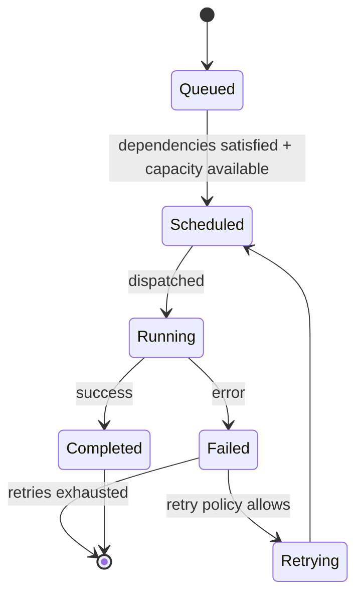

# Scheduler

## Executive Summary
The PAIOS scheduler assigns queued tasks to available execution capacity using a priority-weighted, dependency-aware algorithm, with configurable fairness across teams/product areas in multi-tenant deployments.

## Scheduling Algorithm
1. Tasks enter a priority queue keyed by `(priority, submission_time, dependency_readiness)`.
2. The scheduler filters for tasks whose dependencies (see [task-manager.md](task-manager.md)) are satisfied.
3. Resource Manager is consulted for available capacity (browser executors, LLM quota).
4. Tasks are dispatched in priority order, respecting per-tenant fairness quotas.

## State Diagram

## Failure Handling
Configurable retry policy (exponential backoff, max attempts) per task type. Failed tasks after exhausted retries emit `task.failed.terminal` for human escalation via [docs/13-workflow-engine/human-approval.md](../13-workflow-engine/human-approval.md).

## Performance
Designed for O(log n) dispatch decisions via a binary heap priority queue; benchmarked throughput in [benchmarks/](../../benchmarks/).

## References
- [resource-manager.md](resource-manager.md)
- [state-machine.md](state-machine.md)
