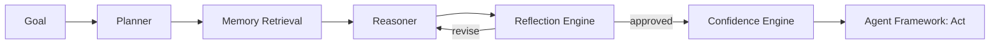

# AI Runtime Overview

## Executive Summary
The AI Runtime translates high-level goals ("validate the checkout flow before release") into concrete, executable plans, using a Plan → Reason → Reflect → Act loop informed by retrieved engineering memory.

## Internal Architecture

## Design Goals
- Every plan must be revised at least once by the Reflection Engine before execution.
- Every action carries a confidence score; low-confidence actions escalate to human review (see [docs/13-workflow-engine/human-approval.md](../13-workflow-engine/human-approval.md)).

## References
- [planner.md](planner.md)
- [reflection-engine.md](reflection-engine.md)
