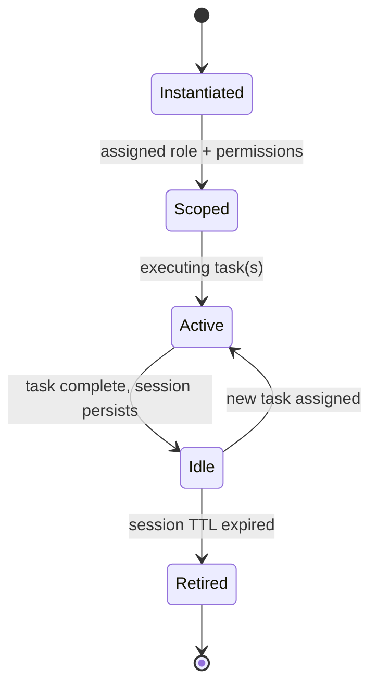

# Agent Lifecycle

## Executive Summary
Defines how agents are instantiated, scoped, executed, and retired within the kernel's task execution model.

## Lifecycle Diagram

## References
- [../03-ai-runtime/agent-runtime.md](../03-ai-runtime/agent-runtime.md)
