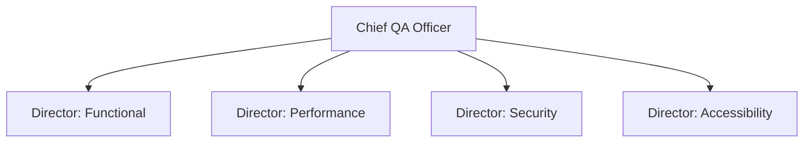

# Chief QA Officer Agent

## Executive Summary
The CQO agent is the single top-level strategic agent responsible for organization-wide quality posture. It does not execute tests; it sets quality strategy, allocates Director-level focus, and owns the final release confidence narrative presented to humans.

## Responsibilities
- Maintain organization-wide quality OKRs and track them against [Release Intelligence](../12-release-intelligence/README.md) trends.
- Allocate Director-agent attention across functional, performance, security, and accessibility domains.
- Escalate systemic quality risks (e.g., a recurring root-cause pattern across teams) to human engineering leadership.

## Diagram

## References
- [director-layer.md](director-layer.md)
