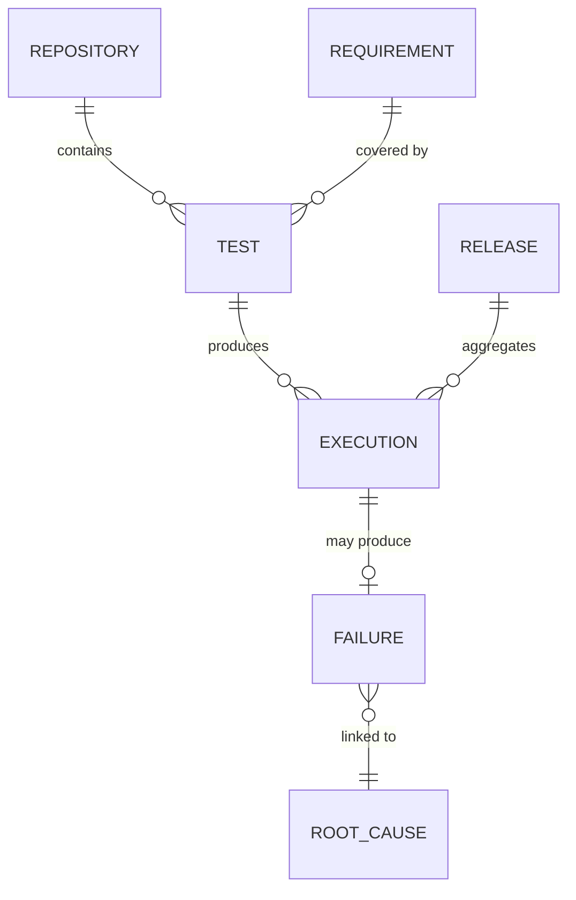

# Engineering Memory

## Executive Summary
Engineering Memory is the unifying model across six memory domains — repository, test, requirement, execution, failure, and release — all linked through the [Knowledge Graph](../06-knowledge-graph/README.md) so that a query in one domain (e.g., "failures") can traverse into related domains (e.g., "which tests, which requirements, which releases").

## Design Goals
- No engineering fact is ever discarded without an explicit pruning decision (see [memory-pruning.md](memory-pruning.md)).
- Every memory record is queryable both structurally (graph traversal) and semantically (vector search, see [docs/07-semantic-search](../07-semantic-search/README.md)).

## Domain Model

## References
- [test-memory.md](test-memory.md)
- [failure-memory.md](failure-memory.md)
