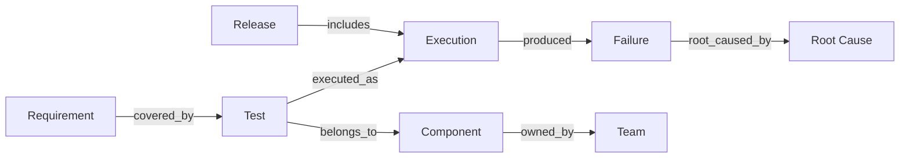

# Graph Model

## Executive Summary
PAIOS models the engineering domain as a property graph: typed nodes (entities) connected by typed, directed edges (relationships), queryable via both traversal and semantic similarity.

## Diagram

## References
- [entities.md](entities.md)
- [relationships.md](relationships.md)
